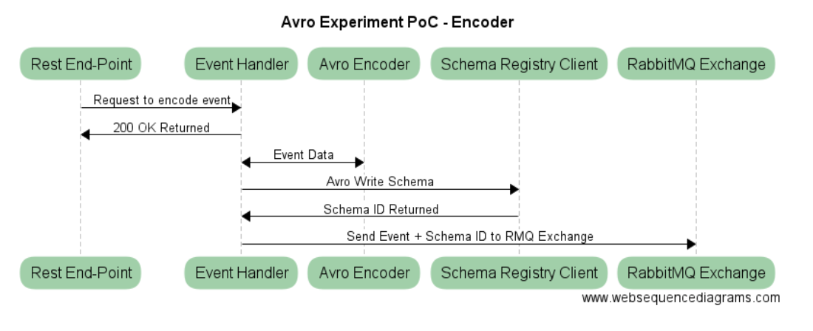
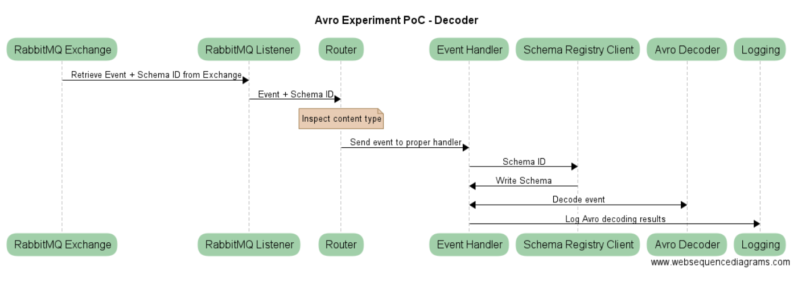
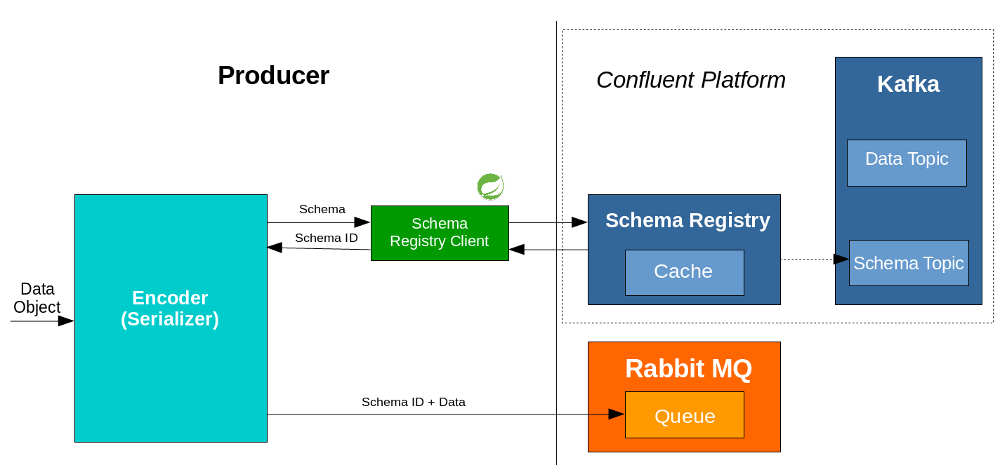
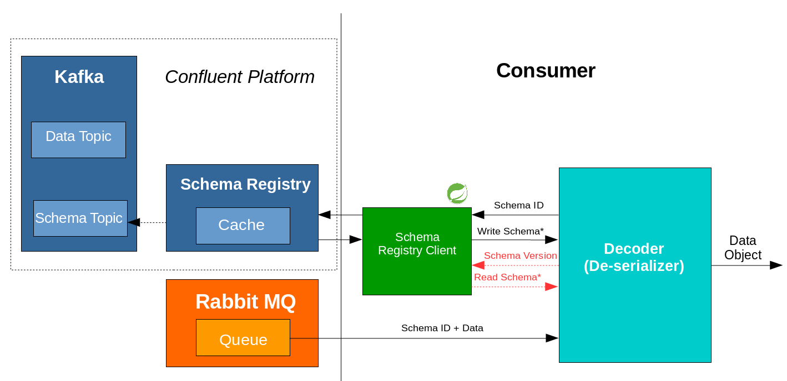

# avro-experiment-poc

## Overview
Avro Experiment Proof of Concept contains examples of using Avro for data serialization/deserialization. 

There are a few problems that could annoy you when working on or updating application-producer that is used by multiple data consumers:

* producer and all consumers should be updated simultaneously otherwise outdated consumer crashes. It means that often you should coordinates your updates with other teams to not break them. Also you can't update consumer before producer. 
* JSON is too slow to parse and also doesn’t differentiate between data styles i.e (int, float), (string,unicode)

[Avro](https://avro.apache.org/docs/1.8.1/gettingstartedjava.html) is the cross-language serialization library. It uses schema that defined the data structure in a JSON format.

## Prerequisites
* [JDK 8](http://www.oracle.com/technetwork/java/index.html) installed and working
* Building under [Ubuntu Linux](http://www.ubuntu.com/) is supported and recommended 
* [Confluent Schema Registry](http://docs.confluent.io/1.0/schema-registry/docs/index.html) running. 
Use the [Confluent Platform Quickstart](http://docs.confluent.io/3.0.1/quickstart.html) guide to start it.
* [RabbitMQ](https://www.rabbitmq.com/download.html) running on the custom port. 

## Building
Type `./gradlew` to build and assemble the service.

## Rest API Documentation

This project consists of two independent parts: Encoder and Decoder.

Encoder has a few REST inbound end-points and outbound RabbitMQ exchange. Each entrypoint demonstrates different avro use case:

 Rest Endpoints           | Http method  | Description  
 ------------------------ | ------------ | -----------------
 /course/install/v1_to_v1 |  POST        | The example of document avro serialization/deserialization to json format using the same schema. 
 /course/install/v1_to_v2 |  POST        | The example of document avro serialization/deserialization to json format using different write and read schemas. 
 /course/install/v1_to_v3 |  POST        | The example of document avro serialization/deserialization to json format using incompatible write and read schemas. 
 /lesson/status           |  POST        | The example of document avro serialization/deserialization to binary using the same schema. 

## Encoder

The proper event handler based on selected entry point encodes your event data using appropriate avro schema, saves schema to the Schema Registry and sends encoded event data with schema id to RabbitMQ exchange. The sequence diagram of Encoder workflow you can see below:



## Decoder

Decoder `MessageListener` retrieves messages (encoded events) from RabbitMQ exchange, retrieves proper schema from Schema Registry using schema id attached in message headers and decodes event data. The results of decoding are just simply logged.



## Schema Registry

To understand better the connection with Schema Registry investigate diagrams below:





## Demo

Let's consider we run Avro-Experiment-PoC using REST endpoint that demonstrates connection between outdated Producer that uses version 1 and Consumer that uses updated version 2 of AVRO event schema.

**Version 1 of event.course.install**

```diff
{
"namespace": "event.course_install",
"type": "record",
"name": "CourseInstall",
"doc": "The first version of the course install document",
"fields": [
        {"name": "course",
         "type": {
             "type": "record",
             "name": "Course",
             "doc": "The course instance.",
             "fields": [
                {"name": "uuid", "type": "string", "doc": "Course UUID."},
+                {"name": "name", "type": "string", "aliases": ["courseName"], "doc": "Course display name."},
                {"name": "knownLanguage", "type": "string", "doc": "Course Known Language."},
                {"name": "targetLanguage", "type": "string", "doc": "Course Target Language."},
                {"name": "product", "type": "string", "doc": "Course Product."}
            ]
        }
        },
        {"name": "units",
         "type": {
            "type": "array",
            "items": {
                "type": "record",
                "name": "Unit",
                "doc": "The course unit instance.",
                "fields": [
-                    {"name": "id", "type": "int", "default": 0, "doc": "Course Init ID."},
                    {"name": "uuid", "type": "string", "doc": "Course Unit UUID."},
                    {"name": "name", "type": "string", "doc": "Course Unit Display Name."},
                    {"name": "maxScore", "type": "int", "doc": "Course Unit MaxScore."},
                    {"name": "minScore", "type": "int", "doc": "Course Unit MinScore."},
                    {"name": "hasAssessment", "type": "boolean", "doc": "Course Unit has Assessment (minScore > 0)."},
                    {"name": "lessons",
                     "type": {
                        "type": "array",
                        "items": {
                            "type": "record",
                            "name": "Lesson",
                            "doc": "Lesson instance.",
                            "fields": [
                                {"name": "id", "type": "int", "doc": "Lesson id."},
                                {"name": "uuid", "type": "string", "doc": "Lesson UUID."},
                                {"name": "name", "type": "string", "doc": "Lesson Name."},
                                {"name": "position", "type": "int", "doc": "Lesson Position in the Unit."},
                                {"name": "isAssessment", "type": "boolean", "doc": "If Lesson is an Assessment."}
                                ]
                            }
                        }
                    }
                    ]
                }
            }
         }
    ]
}

```

**Version 2 of event.course.install**

```diff
{
"namespace": "event.course_install",
"type": "record",
"name": "CourseInstall",
"doc": "The second version of the course install document",
"fields": [
        {"name": "course",
         "type": {
             "type": "record",
             "name": "Course",
             "doc": "The course instance.",
             "fields": [
                {"name": "uuid", "type": "string", "doc": "Course UUID."},
+                {"name": "courseName", "type": "string", "aliases": ["name"], "default": "default value", "doc": "Course display name."},
                {"name": "knownLanguage", "type": "string", "doc": "Course Known Language."},
                {"name": "targetLanguage", "type": "string", "doc": "Course Target Language."},
                {"name": "product", "type": "string", "doc": "Course Product."}
            ]
        }
        },
        {"name": "units",
         "type": {
            "type": "array",
            "items": {
                "type": "record",
                "name": "Unit",
                "doc": "The course unit instance.",
                "fields": [
                    {"name": "uuid", "type": "string", "doc": "Course Unit UUID."},
                    {"name": "name", "type": "string", "doc": "Course Unit Display Name."},
                    {"name": "maxScore", "type": "int", "doc": "Course Unit MaxScore."},
                    {"name": "minScore", "type": "int", "doc": "Course Unit MinScore."},
                    {"name": "hasAssessment", "type": "boolean", "doc": "Course Unit has Assessment (minScore > 0)."},
                    {"name": "lessons",
                     "type": {
                        "type": "array",
                        "items": {
                            "type": "record",
                            "name": "Lesson",
                            "doc": "Lesson instance.",
                            "fields": [
                                {"name": "id", "type": "int", "doc": "Lesson id."},
                                {"name": "uuid", "type": "string", "doc": "Lesson UUID."},
                                {"name": "name", "type": "string", "doc": "Lesson Name."},
                                {"name": "position", "type": "int", "doc": "Lesson Position in the Unit."},
                                {"name": "isAssessment", "type": "boolean", "doc": "If Lesson is an Assessment."}
                                ]
                            }
                        }
                    },
+                    {"name": "newField", "type": "string", "default": "default value for new string", "doc": "Added new field to the second document version."}
                    ]
                }
            }
         }
    ]
}

```

As you have noticed in version 2 we renamed `name` field of Course to `courseName`, removed `id` field of Unit and added new field `newField` to Unit. Avro approach perfectly deals with those changes. You can see two documents below: first one is encoded document that was sent to RabbitMQ Exchange by Encoder and the second one is the decoded document that was logged by Decoder.

**Encoded document that was sent to RabbitMQ exchange by Encoder**

```diff
"course" : {
    "uuid" : "fb88ad20-1702-11e3-a517-50e5494249f7",
+    "name" : "Russian Essentials Ver.2",
    "knownLanguage" : "RUSSIAN",
    "targetLanguage" : "ENGLISH",
    "product" : "LessonGin"
  },
  "units" : [
    {
-    "id" : 81,
    "uuid" : "7764b0f0-9d28-4c2a-82b9-3cb5daba3335",
    "name" : "Unit 1",
    "maxScore" : 8,
    "minScore" : 4,
    "hasAssessment" : true,
    "lessons" : [ {
      "id" : 229,
      "uuid" : "e7594991-0d76-4f88-b265-ca7235364338",
      "name" : "Lesson 1",
      "position" : 1,
      "isAssessment" : false
    }
 ]
```

**Decoded document that was logged by Decoder**

```diff
"course": {
        "uuid": "fb88ad20-1702-11e3-a517-50e5494249f7",
+        "courseName": "Russian Essentials Ver.2",
        "knownLanguage": "RUSSIAN",
        "targetLanguage": "ENGLISH",
        "product": "LessonGin"
    },
    "units": [
        {
            "uuid": "7764b0f0-9d28-4c2a-82b9-3cb5daba3335",
            "name": "Unit 1",
            "maxScore": 8,
            "minScore": 4,
            "hasAssessment": true,
            "lessons": [
                {
                    "id": 229,
                    "uuid": "e7594991-0d76-4f88-b265-ca7235364338",
                    "name": "Lesson 1",
                    "position": 1,
                    "isAssessment": false
                }
            ],
+            "newField": "default value for new string"
        }
    ]
```

## Operations Endpoints
The services supports a variety of endpoints useful to an Operations engineer.

* `/operations` - Provides a hypermedia-based “discovery page” for the other endpoints.
* `/operations/actuator` - Provides a hypermedia-based “discovery page” for the other endpoints.
* `/operations/autoconfig` - Displays an auto-configuration report showing all auto-configuration candidates and the reason why they ‘were’ or ‘were not’ applied.
* `/operations/beans` - Displays a complete list of all the Spring beans in your application.
* `/operations/configprops` - Displays a collated list of all `@ConfigurationProperties`.
* `/operations/docs` - Displays documentation, including example requests and responses, for the Actuator’s endpoints.
* `/operations/dump` - Performs a thread dump.
* `/operations/env` - Exposes properties from Spring’s `ConfigurableEnvironment`.
* `/operations/flyway` - Shows any `Flyway` database migrations that have been applied.
* `/operations/health` - Shows application health information.
* `/operations/info` - Displays arbitrary application info.
* `/operations/liquibase` - Shows any `Liquibase` database migrations that have been applied.
* `/operations/logfile` - Returns the contents of the logfile (if logging.file or logging.path properties have been set).
* `/operations/metrics` - Shows ‘metrics’ information for the current application.
* `/operations/mappings` - Displays a collated list of all `@RequestMapping` paths.
* `/operations/shutdown` - Allows the application to be gracefully shutdown (not enabled by default).
* `/operations/trace` - Displays trace information (by default the last few HTTP requests).